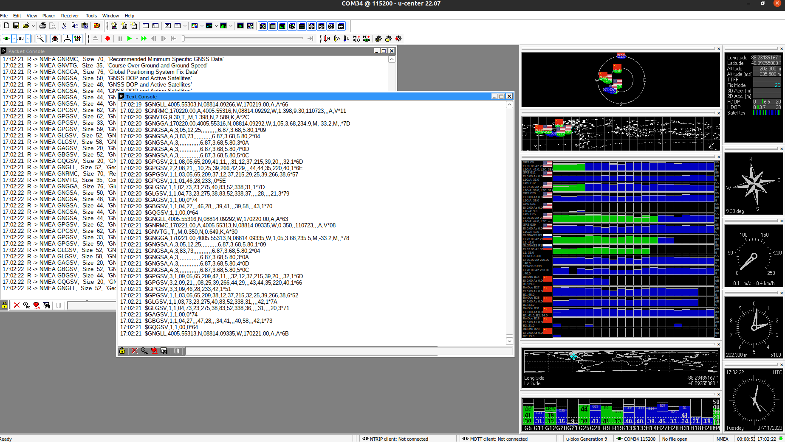
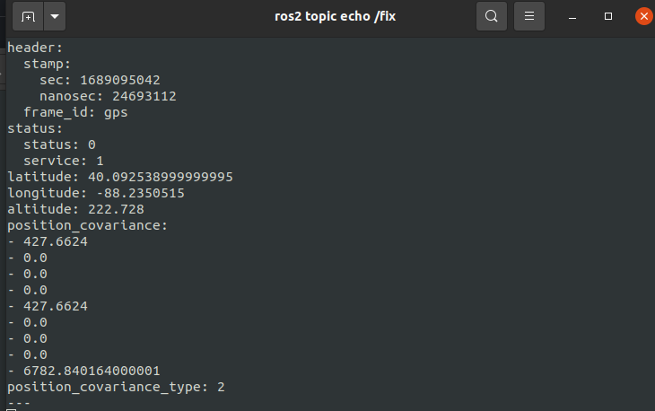

## Description
This package provides **ROS2** support for **u-blox ZED F9P GPS receivers**. Most of this driver has been written based off the original ROS(1) driver that can be found here: https://github.com/KumarRobotics/ublox/tree/master Changes made to support the latest firmware are listed below: 

Features:

- Fast and robust
- Tested *only* for serial connections
- Can play back PCAP capture logs to test behavior
- Easy to add support for more log types
- Supports ASCII and binary-format logs
- Can synchronize `BESTPOS`, `BESTVEL`, and `PSRDOP2` logs together in order to produce 
[gps_common/GPSFix](http://docs.ros.org/kinetic/api/gps_common/html/msg/GPSFix.html) messages
- Can produce IMU data from receives with SPAN support

### Supports:
```
- Ubuntu 20.04 (Tested)
- Ubuntu 22.04 (Untested)
- ROS2 Foxy and ROS2 Galactic (Tested)
- ROS2 Humble (Untested)
- Colcon
- Firmware 9
```

### Note: This driver has to be installed locally:
```
mkdir -p ublox_ws/src
cd ublox_ws/src
git clone https://github.com/gokulp01/ros2-ublox-zedf9p.git
cd ..
colcon build
``` 

### To run the driver:
```
ros2 launch ublox_gps ublox_gps_node_zedf9p-launch.py
```

Note: Values are published on `/fix` topic





## Some common errors and how to fix them (this list will be updated as and when new issues are raised.
1. `Could NOT find asio (missing: ASIO_INCLUDE_DIR)`: To fix it, install the asio package on your system.
   
   ```sudo apt-get install libasio-dev```
Source and build again.


## Options
The `ublox_gps` node supports the following parameters for all products and firmware versions:
* `device`: Path to the device port. Defaults to `/dev/ttyACM0`.
* `raw_data`: Whether the device is a raw data product. Defaults to false. Firmware <= 7.03 only.
* `load`: Parameters for loading the configuration to non-volatile memory. See `ublox_msgs/CfgCFG.msg`
    * `load/mask`: uint32_t. Mask of the configurations to load.
    * `load/device`: uint32_t. Mask which selects the devices for the load command.
* `save`: Parameters for saving the configuration to non-volatile memory. See `ublox_msgs/CfgCFG.msg`
    * `save/mask`: uint32_t. Mask of the configurations to save.
    * `save/device`: uint32_t. Mask which selects the devices for the save command.
* `uart1/baudrate`: Bit rate of the serial communication. Defaults to 9600.
* `uart1/in`: UART1 in communication protocol. Defaults to UBX, NMEA & RTCM. See `CfgPRT` message for possible values.
* `uart1/out`: UART1 out communication protocol. Defaults to UBX, NMEA & RTCM. See `CfgPRT` message for possible values.
* `frame_id`: ROS name prepended to frames produced by the node. Defaults to `gps`.
* `rate`: Rate in Hz of measurements. Defaults to 4.
* `nav_rate`: How often navigation solutions are published in number of measurement cycles. Defaults to 1.
* `enable_ppp`: Enable precise-point-positioning system. Defaults to false.
* `gnss/sbas`: Enable satellite-based augmentation system. Defaults to false.
* `sbas/max`: Maximum number of SBAS channels. Defaults to 0.
* `sbas/usage`: See `CfgSBAS` message for details. Defaults to 0.
* `dynamic_model`: Possible values below. Defaults to `portable`. See u-blox documentation for further description.
    * `portable`
    * `stationary`
    * `pedestrian`
    * `automotive`
    * `sea`
    * `airborne1`: Airborne, max acceleration = 1G
    * `airborne2`: Airborne, max acceleration = 2G
    * `airborne4`: Airborne, max acceleration = 4G
    * `wristwatch`
* `fix_mode`: Type of fixes supported: `2d`, `3d` or `both`.
* `dr_limit`: Max time in seconds to use dead reckoning after signal is lost. Defaults to 0.
* `dat`: Configuring the datum type (optional). See the CfgDAT message.
    * `dat/set`: If true, the node will the datum based on the parameters below (required if true). Defaults to false. 
    * `dat/majA`: Semi-major Axis [m]
    * `dat/flat`: 1.0 / Flattening
    * `dat/shift`: [X-axis, Y-axis, Z-axis] shift [m]
    * `dat/rot`: [X, Y, Z] rotation [s]
    * `dat/scale`: scale change [ppm]

### For UDR/ADR devices:
* `use_adr`: Enable ADR/UDR. Defaults to true.
* `nav_rate` should be set to 1 Hz.

### For HPG Reference devices:
* `tmode3`: Time Mode. Required. See CfgTMODE3 for constants.
* `arp/lla_flag`: True if the Fixed position is in Lat, Lon, Alt coordinates. False if ECEF. Required if `tmode3` is set to fixed. 
* `arp/position`: Antenna Reference Point position in [m] or [deg]. Required if `tmode3` is set to fixed. 
* `arp/position_hp`: Antenna Reference Point High Precision position in [0.1 mm] or [deg * 1e-9]. Required if tmode3 is set to fixed. 
* `arp/acc`: Fixed position accuracy in [m]. Required if `tmode3` is set to fixed. 
* `sv_in/reset`: Whether or not to reset the survey in upon initialization. If false, it will only reset if the TMODE is disabled. Defaults to true.
* `sv_in/min_dur`: The minimum Survey-In Duration time in seconds. Required tmode3 is set to survey in.
* `sv_in/acc_lim`: The minimum accuracy level of the survey in position in meters. Required `tmode3` is set to survey in.

### For HPG Rover devices:
* `dgnss_mode`: The Differential GNSS mode. Defaults to RTK FIXED. See `CfgDGNSS` message for constants.

### For TIM devices:
* `tim_tm2`: Enable this message for GPS time-stamps everytime an external interrupt signal is received.

### For FTS devices:
* currently unimplemented. See `FtsProduct` class in `ublox_gps` package `node.h` & `node.cpp` files.

## Fix Topics

`~fix`([sensor_msgs/NavSatFix](http://docs.ros.org/api/sensor_msgs/html/msg/NavSatFix.html))

Navigation Satellite fix.

`~fix_velocity`([geometry_msgs/TwistWithCovarianceStamped](http://docs.ros.org/jade/api/geometry_msgs/html/msg/TwistWithCovarianceStamped.html))

Velocity in local ENU frame.

## INF messages
To enable printing INF messages to the ROS console, set the parameters below.
* `inf/all`: This is the default value for the INF parameters below, which enable printing u-blox `INF` messages to the ROS console. It defaults to true. Individual message types can be turned off by setting their corresponding parameter to false.
* `inf/debug`: Whether to configure the UBX and NMEA ports to send Debug messages and print received `INF-Debug` messages to `ROS_DEBUG` console.
* `inf/error`: Whether to enable Error messages for the UBX and NMEA ports and print received `INF-Error` messages to `ROS_ERROR` console.
* `inf/notice`: Whether to enable Notice messages for the UBX and NMEA ports and print received `INF-Notice messages to `ROS_INFO` console.
* `inf/test`: Whether to enable Test messages for the UBX and NMEA ports and print received `INF-Test` messages to `ROS_INFO` console.
* `inf/warning`: Whether to enable Warning messages for the UBX and NMEA ports and print received `INF-Warning` messages to the `ROS_WARN` console.

## Additional Topics
To publish a given u-blox message to a ROS topic, set the parameter shown below to true. The node sets the rate of the u-blox messages to 1 measurement cycle. 

### All messages
* `publish/all`: This is the default value for `publish/<class>/all` parameters below. It defaults to false. Individual message classes and messages can be enabled or disabled by setting the parameters described below to false.

### AID messages
* `publish/aid/all`: This is the default value for the `publish/aid/<message>` parameters below. It defaults to `publish/all`. Individual messages can be enabled or disabled by setting the parameters below.
* `publish/aid/alm`: Topic `~aidalm`
* `publish/aid/eph`: Topic `~aideph`
* `publish/aid/hui`: Topic `~aidhui`

### RXM messages
* `publish/rxm/all`: This is the default value for the `publish/rxm/<message>` parameters below. It defaults to `publish/all`. Individual messages can be enabled or disabled by setting the parameters below.
* `publish/rxm/alm`: Topic `~rxmalm`
* `publish/rxm/eph`: Topic `~rxmeph`
* `publish/rxm/raw`: Topic `~rxmraw`. Type is either `RxmRAW` or `RxmRAWX` depending on firmware version.
* `publish/rxm/rtcm`: Topic `~rxmrtcm`. **Firmware >= 8 only**
* `publish/rxm/sfrb`: Topic `~rxmsfrb`. Type is either `RxmSFRB` or `RxmSFRBX` depending on firmware version.

### MON messages
* `publish/mon/all`: This is the default value for the `publish/mon/<message>` parameters below. It defaults to `publish/all`. Individual messages can be enabled or disabled by setting the parameters below.
* `publish/mon/hw`: Topic `~monhw`

### NAV messages
* `publish/nav/all`: This is the default value for the `publish/mon/<message>` parameters below. It defaults to `publish/all`. Individual messages can be enabled or disabled by setting the parameters below.
* `publish/nav/att`: Topic `~navatt`. **ADR/UDR devices only**
* `publish/nav/clock`: Topic `~navclock`
* `publish/nav/posecef`: Topic `~navposecef`
* `publish/nav/posllh`: Topic `~navposllh`. **Firmware <= 6 only.** For firmware 7 and above, see NavPVT
* `publish/nav/pvt`: Topic `~navpvt`. **Firmware >= 7 only.**
* `publish/nav/relposned`: Topic `~navrelposned`. **HPG Rover devices only**
* `publish/nav/heading`: Topic `~navheading`. **HP Position receiver devices only.** For firmware 9 and above
* `publish/nav/sat`: Topic `~navsat`
* `publish/nav/sol`: Topic `~navsol`. **Firmware <= 6 only.** For firmware 7 and above, see NavPVT
* `publish/nav/status`: Topic `~navstatus`
* `publish/nav/svin`: Topic `~navsvin`. **HPG Reference Station Devices only**
* `publish/nav/svinfo`: Topic `~navsvinfo`
* `publish/nav/velned`: Topic `~navvelned`. **Firmware <= 6 only.** For firmware 7 and above, see NavPVT

### ESF messages
* `publish/esf/all`: This is the default value for the `publish/esf/<message>` parameters below. It defaults to `publish/all` for **ADR/UDR devices**. Individual messages can be enabled or disabled by setting the parameters below.
* `publish/esf/ins`: Topic `~esfins`
* `publish/esf/meas`: Topic `~esfmeas`
* `publish/esf/raw`: Topic `~esfraw`
* `publish/esf/status`: Topic `~esfstatus`

### HNR messages
* `publish/hnr/pvt`: Topic `~hnrpvt`. **ADR/UDR devices only**

### TIM messages
* `publish/tim/tm2`: Topic `timtm2`. **TIM devices only**


## Adding new parameters
1. Modify the `getRosParams()` method in the appropriate implementation of ComponentInterface (e.g. UbloxNode, UbloxFirmware8, HpgRefProduct, etc.) and get the parameter. Group multiple related parameters into a namespace. Use all lower case names for parameters and namespaces separated with underscores. 
* If the type is an unsigned integer (of any size) or vector of unsigned integers, use the `ublox_node::getRosUint` method which will verify the bounds of the parameter.
* If the type is an int8 or int16 or vector of int8's or int16's, use the `ublox_nod::getRosInt` method which will verify the bounds of the parameter. (This method can also be used for int32's but ROS has methods to get int32 parameters as well).
2. If the parameter is used during configuration also modify the `ComponentInterface`'s `configureUblox()` method to send the appropriate configuration message. Do not send configuration messages in `getRosParams()`.
3. Modify this README file and add the parameter name and description in the appropriate section. State whether there is a default value or if the parameter is required.
4. Modify one of the sample `.yaml` configuration files in `ublox_gps/config` to include the parameter or add a new sample `.yaml` for your device.


## Debugging

For debugging messages set the debug parameter to > 0. The range for debug is 0-4. At level 1 it prints configuration messages and checksum errors, at level 2 it also prints ACK/NACK messages and sent messages. At level 3 it prints the received bytes being decoded by a specific message reader. At level 4 it prints the incoming buffer before it is split by message header.


# Links
Consult the [official protocol spec](https://content.u-blox.com/sites/default/files/documents/EVK-F9P-01_UserGuide_UBX-22038408.pdf) for details on packets supported by u-blox devices.


